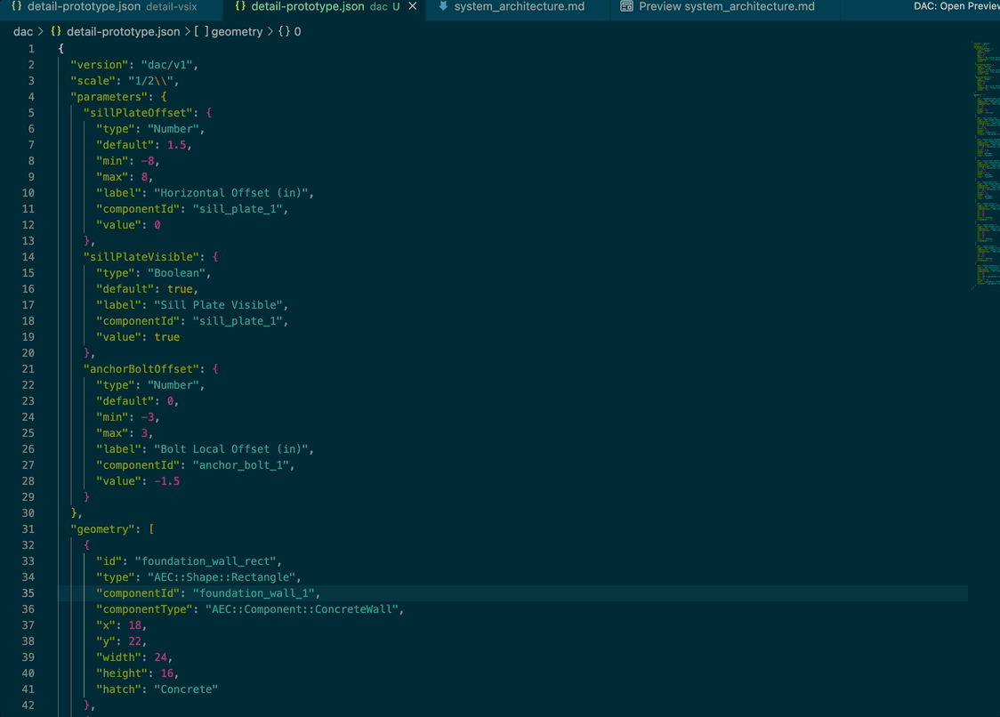

# Parametric 2D CAD Detail Visualizer (DaC)

The VS Code extension for **Drawings as Code (DaC)**. Renders parametric construction details as interactive, blueprint-style drawings directly within your IDE. 

Designed for structural engineers, draftsmen, and software agents, this extension bridges the gap between structured JSON engineering schemas and visual validation.

---

## Key Features

* 🚀 **Real-time Vector Rendering**: Instantly compiles parametric configurations into blueprint-style SVG vectors inside a split-screen Webview panel.
* 🖱️ **Interactive SVG Selection**: Click directly on any element in the blueprint canvas (like concrete foundations or wood sill plates) to focus it and inspect its properties.
* 🔄 **Bidirectional Parameter Sync**: Adjust parameters via form controls (sliders, checkbox toggles, numbers) in the sidebar, and watch the editor's active JSON buffer update and save in real-time.
* 📐 **Annotative Scaling**: Supports model space vs. paper space separation. Structural geometry scales dynamically while dimensions, labels, and hatch patterns maintain constant legibility on screen.
* 🔍 **Infinite Vector Zoom & Pan**: Scroll-to-zoom and click-drag to pan around complex details with infinite SVG crispness.



---

## Getting Started

1. Open any parametric detail specification file (e.g., `detail-prototype.json`) conforming to the `dac/v1` schema.
2. Click the **DAC: Open Preview** button in the editor title bar menu (top-right of the editor pane).
3. Alternatively, right-click the JSON file in the explorer context menu and select **DAC: Open Preview**.
4. Edit the parameter values in the sidebar form or click on the SVG elements to inspect details.

---

## File Schema Support

This extension activates and renders files containing the `dac/v1` version tag:

```json
{
  "version": "dac/v1",
  "scale": "1/2\" = 1'-0\"",
  "parameters": {
    "sillPlateOffset": {
      "type": "Number",
      "default": 1.5,
      "min": -8,
      "max": 8,
      "label": "Offset (in)"
    }
  },
  "geometry": [
    {
      "type": "AEC::Shape::Rectangle",
      "componentId": "sill_plate_1",
      "componentType": "Timber Sill Plate",
      "x": "240 + {parameters.sillPlateOffset}",
      "y": 182,
      "width": 140,
      "height": 38
    }
  ]
}
```

---

## Requirements

* **VS Code**: Version `1.80.0` or higher (also supports compatible forks like Cursor and Antigravity).
* **Node.js**: Version `18.x` or higher (for local development/compilation).
